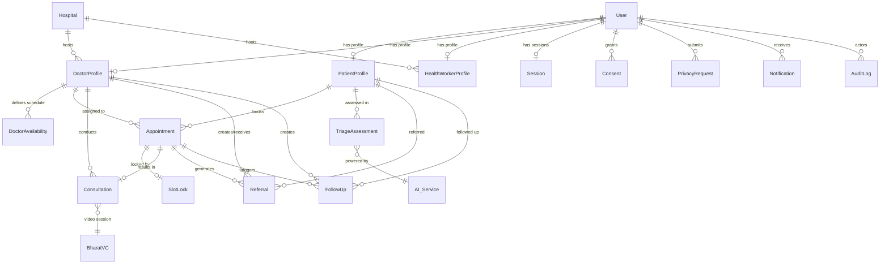

# Swasthya Sathi — Database Schema Diagram

## Entity Relationship Diagram (Mermaid)



## Detailed Schema

### Core Identity

#### User
```
┌─────────────────────────────────────────────────┐
│  User                                            │
├─────────────────────────────────────────────────┤
│  internalUserId      String   PK, unique, idx   │
│  externalIdentityProvider  String  [mock|meripehchaan] │
│  externalIdentityReference  String  unique, sparse │
│  role                String   [PATIENT|DOCTOR|   │
│                               HEALTH_WORKER|ADMIN]│
│  status              String   [ACTIVE|DISABLED|  │
│                               PENDING_VERIFICATION]│
│  lastLoginAt         Date                          │
│  consentVersionAccepted  String                   │
│  createdAt           Date     auto                │
│  updatedAt           Date     auto                │
└─────────────────────────────────────────────────┘
```

#### Session
```
┌─────────────────────────────────────────────────┐
│  Session                                         │
├─────────────────────────────────────────────────┤
│  sessionTokenHash    String   PK, unique         │
│  internalUserId      String   FK→User, idx       │
│  role                String   idx                 │
│  userAgent           String                       │
│  ip                  String                       │
│  expiresAt           Date     idx                 │
│  revokedAt           Date                         │
│  revokedReason       String  [LOGOUT|ADMIN_REVOKE│
│                              |SECURITY|EXPIRED]   │
│  createdAt           Date     auto                │
│  updatedAt           Date     auto                │
└─────────────────────────────────────────────────┘
```

### Profiles

#### PatientProfile
```
┌─────────────────────────────────────────────────┐
│  PatientProfile                                   │
├─────────────────────────────────────────────────┤
│  patientId            String   PK, unique         │
│  internalUserId       String   FK→User, unique    │
│  displayName          String   max 120            │
│  dateOfBirth          Date                         │
│  sex                  String  [M|F|OTHER|         │
│                               UNSPECIFIED]        │
│  preferredLanguage    String   default "en"        │
│  preferredConsultationMode  String  [IN_PERSON|   │
│                                     VIDEO|AUDIO]  │
│  accessibilityPreferences  String[]               │
│  emergencyContactName String   max 120            │
│  emergencyContactPhone String  max 20             │
│  addressRegion        String   max 120            │
│  addressDistrict      String   max 120            │
│  privacyPreferences.shareAnonymizedForResearch  Bool│
│  createdAt           Date     auto                │
│  updatedAt           Date     auto                │
└─────────────────────────────────────────────────┘
```

#### DoctorProfile
```
┌─────────────────────────────────────────────────┐
│  DoctorProfile                                    │
├─────────────────────────────────────────────────┤
│  doctorId             String   PK, unique         │
│  internalUserId       String   FK→User, unique    │
│  displayName          String   max 120            │
│  specialization       String   max 160            │
│  qualifications       String[]                    │
│  facilityId           String   FK→Hospital, idx   │
│  facilityName         String   max 160            │
│  verificationStatus   String  [UNVERIFIED|PENDING│
│                               |VERIFIED|REJECTED] │
│  verificationMetadata.verifiedById  String        │
│  verificationMetadata.verifiedAt    Date          │
│  consultationModes    String[]  [IN_PERSON|       │
│                                  VIDEO|AUDIO]     │
│  consultationFee      Number                      │
│  languages            String[]  default ["en"]    │
│  experienceYears      Number                      │
│  bio                  String   max 1000           │
│  createdAt           Date     auto                │
│  updatedAt           Date     auto                │
└─────────────────────────────────────────────────┘
```

#### HealthWorkerProfile
```
┌─────────────────────────────────────────────────┐
│  HealthWorkerProfile                              │
├─────────────────────────────────────────────────┤
│  healthWorkerId       String   PK, unique         │
│  internalUserId       String   FK→User, unique    │
│  displayName          String   max 120            │
│  designation          String   max 120            │
│  facilityId           String   FK→Hospital, idx   │
│  facilityName         String   max 160            │
│  assignedRegion       String   max 160            │
│  active               Bool     default true       │
│  languages            String[]  default ["en"]    │
│  createdAt           Date     auto                │
│  updatedAt           Date     auto                │
└─────────────────────────────────────────────────┘
```

### Scheduling

#### DoctorAvailability
```
┌─────────────────────────────────────────────────┐
│  DoctorAvailability                               │
├─────────────────────────────────────────────────┤
│  doctorId             String   FK→DoctorProfile   │
│  dayOfWeek            Number   0-6 (Sun-Sat)      │
│  startMinute          Number   0-1439             │
│  endMinute            Number   1-1440             │
│  timezone             String   default "Asia/Kolkata"│
│  active               Bool     default true       │
│  consultationDurationMinutes  Number  5-120       │
│  createdAt           Date     auto                │
│  updatedAt           Date     auto                │
│  Compound unique: (doctorId, dayOfWeek, startMinute)│
└─────────────────────────────────────────────────┘
```

#### SlotLock
```
┌─────────────────────────────────────────────────┐
│  SlotLock                                         │
├─────────────────────────────────────────────────┤
│  doctorId             String   FK→DoctorProfile   │
│  scheduledAt          Date                         │
│  appointmentId        String   FK→Appointment, PK │
│  status               String  [HELD|RELEASED]     │
│  releasedAt           Date                         │
│  createdAt           Date     auto                │
│  updatedAt           Date     auto                │
│  Compound unique: (doctorId, scheduledAt) ★       │
└─────────────────────────────────────────────────┘
```

### Appointments & Consultations

#### Appointment
```
┌─────────────────────────────────────────────────┐
│  Appointment                                      │
├─────────────────────────────────────────────────┤
│  appointmentId        String   PK, unique         │
│  patientId            String   FK→PatientProfile  │
│  doctorId             String   FK→DoctorProfile   │
│  facilityId           String   FK→Hospital        │
│  scheduledAt          Date     idx (UTC)           │
│  durationMinutes      Number                      │
│  consultationType     String  [IN_PERSON|VIDEO|   │
│                               AUDIO]              │
│  status               String  [AVAILABLE|BOOKED|  │
│                               CONFIRMED|IN_PROGRESS│
│                               |COMPLETED|CANCELLED│
│                               |NO_SHOW]           │
│  consultationId       String   FK→Consultation     │
│  reason               String   max 2000           │
│  cancelledBy          String                      │
│  cancelledReason      String                      │
│  cancelledAt          Date                         │
│  bookedByUserId       String                      │
│  metadata             Mixed                       │
│  createdAt           Date     auto                │
│  updatedAt           Date     auto                │
│  Indexes: (doctorId,scheduledAt),                 │
│           (patientId,scheduledAt),                │
│           (patientId,status)                      │
└─────────────────────────────────────────────────┘
```

#### Consultation
```
┌─────────────────────────────────────────────────┐
│  Consultation                                     │
├─────────────────────────────────────────────────┤
│  consultationId      String   PK, unique          │
│  appointmentId       String   FK→Appointment, idx │
│  patientId           String   FK→PatientProfile   │
│  doctorId            String   FK→DoctorProfile    │
│  provider            String  [BHARATVC|IN_PERSON] │
│  providerReference   String                       │
│  status              String  [SCHEDULED|ACTIVE|   │
│                              |ENDED|CANCELLED]    │
│  startedAt           Date                          │
│  endedAt             Date                          │
│  createdAt           Date     auto                │
│  updatedAt           Date     auto                │
└─────────────────────────────────────────────────┘
```

### Clinical

#### TriageAssessment
```
┌─────────────────────────────────────────────────┐
│  TriageAssessment                                 │
├─────────────────────────────────────────────────┤
│  triageId             String   PK, unique         │
│  patientId            String   FK→PatientProfile  │
│  language             String   default "en"        │
│  ageGroup             String  [ADULT|CHILD|       │
│                               |INFANT|UNSPECIFIED]│
│  riskLevel            String  [LOW|MODERATE|HIGH  │
│                              |URGENT|UNKNOWN]     │
│  possibleConditions   String[]                    │
│  missingInformation   String[]                    │
│  recommendedAction    String                      │
│  modelVersion         String  "swasthya-triage-1.0"│
│  disclaimer           String                      │
│  source               String  [AI|MANUAL_FALLBACK]│
│  rawSymptomsStored    Bool    default false ★      │
│  createdAt           Date     auto                │
│  updatedAt           Date     auto                │
│  Index: (patientId, createdAt DESC)               │
└─────────────────────────────────────────────────┘
```

#### Referral
```
┌─────────────────────────────────────────────────┐
│  Referral                                         │
├─────────────────────────────────────────────────┤
│  referralId           String   PK, unique         │
│  patientId            String   FK→PatientProfile  │
│  fromDoctorId         String   FK→DoctorProfile   │
│  toFacilityId         String   FK→Hospital        │
│  toDoctorId           String   FK→DoctorProfile   │
│  reason               String   max 3000           │
│  clinicalSummary      String   max 3000           │
│  status               String  [CREATED|SENT|      │
│                               |ACCEPTED|          │
│                               |IN_PROGRESS|       │
│                               |COMPLETED|CANCELLED]│
│  createdByUserId      String                      │
│  acceptedAt           Date                         │
│  completedAt          Date                         │
│  createdAt           Date     auto                │
│  updatedAt           Date     auto                │
│  Index: (patientId, status)                       │
└─────────────────────────────────────────────────┘
```

#### FollowUp
```
┌─────────────────────────────────────────────────┐
│  FollowUp                                         │
├─────────────────────────────────────────────────┤
│  followUpId           String   PK, unique         │
│  patientId            String   FK→PatientProfile  │
│  doctorId             String   FK→DoctorProfile   │
│  appointmentId        String   FK→Appointment     │
│  scheduledAt          Date     idx                 │
│  reason               String   max 2000           │
│  instructions         String   max 2000           │
│  status               String  [PENDING|SCHEDULED  │
│                              |COMPLETED|MISSED    │
│                              |CANCELLED]          │
│  createdByUserId      String                      │
│  createdByRole        String                      │
│  completedAt          Date                         │
│  createdAt           Date     auto                │
│  updatedAt           Date     auto                │
│  Index: (patientId, status)                       │
└─────────────────────────────────────────────────┘
```

### Compliance

#### Consent
```
┌─────────────────────────────────────────────────┐
│  Consent                                          │
├─────────────────────────────────────────────────┤
│  consentId            String   PK, unique         │
│  userId               String   FK→User, idx       │
│  purpose              String  [HEALTHCARE_SERVICE │
│                              |OPTIONAL_RESEARCH   │
│                              |OPTIONAL_ANALYTICS  │
│                              |NOTIFICATIONS]      │
│  version              String                      │
│  status               String  [GRANTED|WITHDRAWN  │
│                              |EXPIRED]            │
│  givenAt              Date     default now        │
│  withdrawnAt          Date                         │
│  withdrawnReason      String                      │
│  source               String  [PWA|ADMIN|IMPORT]  │
│  text                 String                      │
│  createdAt           Date     auto                │
│  updatedAt           Date     auto                │
│  Compound index: (userId, purpose, status)        │
└─────────────────────────────────────────────────┘
```

#### PrivacyRequest
```
┌─────────────────────────────────────────────────┐
│  PrivacyRequest                                   │
├─────────────────────────────────────────────────┤
│  privacyRequestId    String   PK, unique          │
│  userId              String   FK→User, idx        │
│  type                String  [ACCESS|CORRECTION   │
│                              |DELETION|GRIEVANCE] │
│  status              String  [SUBMITTED|          │
│                              |UNDER_REVIEW|       │
│                              |APPROVED|REJECTED   │
│                              |COMPLETED]          │
│  describeData        String   max 3000            │
│  correctionDetails   String   max 3000            │
│  rationale           String   max 3000            │
│  notes               String   max 3000            │
│  reviewerUserId      String                       │
│  decidedAt           Date                          │
│  decisionNote        String   max 3000            │
│  createdAt           Date     auto                │
│  updatedAt           Date     auto                │
│  Index: (userId, createdAt DESC)                  │
└─────────────────────────────────────────────────┘
```

### System

#### Hospital
```
┌─────────────────────────────────────────────────┐
│  Hospital                                         │
├─────────────────────────────────────────────────┤
│  hospitalId          String   PK, unique          │
│  name                String                       │
│  facilityType        String                       │
│  latitude            Number   idx                 │
│  longitude           Number   idx                 │
│  address.line        String                       │
│  address.region      String                       │
│  address.district    String                       │
│  address.state       String                       │
│  address.pincode     String                       │
│  contact             String                       │
│  services            String[]                     │
│  source              String  [BHUVAN|MAPPLS|      │
│                              MANUAL]              │
│  sourceReference     String                       │
│  verified            Bool    default false         │
│  metadata            Mixed                       │
│  createdAt           Date     auto                │
│  updatedAt           Date     auto                │
│  Indexes: (lat,lng), (name)                       │
└─────────────────────────────────────────────────┘
```

#### AuditLog
```
┌─────────────────────────────────────────────────┐
│  AuditLog (append-only)                           │
├─────────────────────────────────────────────────┤
│  eventId             String   PK, unique          │
│  actorUserId         String   FK→User, idx        │
│  actorRole           String                       │
│  action              String   idx                 │
│  resourceType        String                       │
│  resourceId          String                       │
│  result              String  [SUCCESS|FAILURE|    │
│                              DENIED]              │
│  requestId           String   idx                 │
│  ip                  String                       │
│  details             Mixed                       │
│  createdAt           Date     auto                │
│  updatedAt           Date     auto                │
│  Indexes: (actorUserId,createdAt),                │
│           (action,createdAt)                      │
└─────────────────────────────────────────────────┘
```

#### Notification
```
┌─────────────────────────────────────────────────┐
│  Notification                                     │
├─────────────────────────────────────────────────┤
│  notificationId      String   PK, unique          │
│  userId              String   FK→User, idx        │
│  type                String  [APPOINTMENT|        │
│                              |REFERRAL|FOLLOWUP   │
│                              |CONSENT|PRIVACY     │
│                              |GENERAL]            │
│  title               String                       │
│  body                String                       │
│  read                Bool    default false, idx   │
│  readAt              Date                          │
│  link                String                       │
│  createdAt           Date     auto                │
│  updatedAt           Date     auto                │
│  Index: (userId, read, createdAt DESC)            │
└─────────────────────────────────────────────────┘
```

## Key Relationships

```
User (1) ──── (0..1) PatientProfile
User (1) ──── (0..1) DoctorProfile
User (1) ──── (0..1) HealthWorkerProfile
User (1) ──── (0..*) Session
User (1) ──── (0..*) Consent
User (1) ──── (0..*) PrivacyRequest
User (1) ──── (0..*) Notification
User (1) ──── (0..*) UserKey        ★ E2EE public keys

PatientProfile (1) ──── (0..*) Appointment
PatientProfile (1) ──── (0..*) TriageAssessment
PatientProfile (1) ──── (0..*) Referral
PatientProfile (1) ──── (0..*) FollowUp

DoctorProfile (1) ──── (0..*) DoctorAvailability
DoctorProfile (1) ──── (0..*) Appointment
DoctorProfile (1) ──── (0..*) Consultation

Appointment (1) ──── (0..1) SlotLock        ★ double-booking guard
Appointment (1) ──── (0..1) Consultation
Appointment (1) ──── (0..*) Referral
Appointment (1) ──── (0..*) FollowUp

Hospital (1) ──── (0..*) DoctorProfile
Hospital (1) ──── (0..*) HealthWorkerProfile

Incident (1) ──── (0..*) IncidentLogEntry  ★ breach handling
```

### New Models (Gap 3, 4)

#### UserKey
```
┌─────────────────────────────────────────────────┐
│  UserKey                                          │
├─────────────────────────────────────────────────┤
│  keyId              String   PK, unique           │
│  userId             String   FK→User, idx         │
│  publicKey          String   required              │
│  algorithm          String   default "ECDH-P256"   │
│  fingerprint        String   unique                │
│  status             String  [ACTIVE|REVOKED|       │
│                              EXPIRED]              │
│  registeredAt       Date     default now           │
│  expiresAt          Date                          │
│  revokedAt          Date                          │
│  revokedReason      String                       │
│  createdAt          Date     auto                 │
│  updatedAt          Date     auto                 │
│  Index: (userId, status)                          │
└─────────────────────────────────────────────────┘
```

#### Incident (Breach Handling)
```
┌─────────────────────────────────────────────────┐
│  Incident                                         │
├─────────────────────────────────────────────────┤
│  incidentId         String   PK, unique           │
│  severity           String  [LOW|MEDIUM|HIGH|     │
│                              CRITICAL]            │
│  status             String  [DETECTED|ASSESSING|  │
│                              |CONTAINED|NOTIFYING │
│                              |REMEDIATING|         │
│                              |REVIEWING|RESOLVED]  │
│  description        String   required              │
│  affectedUserIds    String[]                      │
│  dataCategories     String[]                      │
│  detectedAt         Date     default now           │
│  assessedAt         Date                          │
│  assessmentNote     String                       │
│  containedAt        Date                          │
│  containmentActions String[]                      │
│  notifiedAt         Date                          │
│  notifiedUserIds    String[]                      │
│  dpdpNotificationRequired  Bool                   │
│  remediatedAt       Date                          │
│  remediationSteps   String[]                      │
│  reviewedAt         Date                          │
│  reviewNotes        String                       │
│  reportedByUserId   String   FK→User              │
│  reportedToCERTIn   Bool    default false         │
│  createdAt          Date     auto                 │
│  updatedAt          Date     auto                 │
│  Index: (status, severity), (detectedAt)         │
└─────────────────────────────────────────────────┘
```

## Design Notes

- **No ChatMessage model**: E2EE messages are never stored (server relay only)
- **SlotLock unique index**: `(doctorId, scheduledAt)` — atomic double-booking prevention
- **rawSymptomsStored: false**: Triage stores structured results, NOT raw symptom text
- **AuditLog append-only**: Never modified after creation
- **Consent purposes**: Granular per DPDP Act 2023 (healthcare, research, analytics, notifications)
- **Privacy request types**: ACCESS, CORRECTION, DELETION, GRIEVANCE per DPDP
